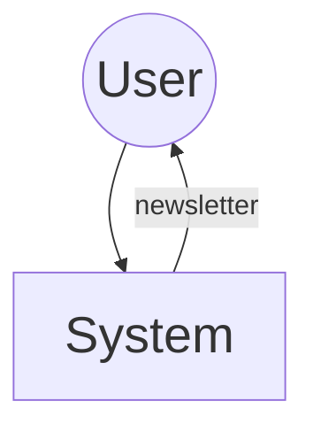
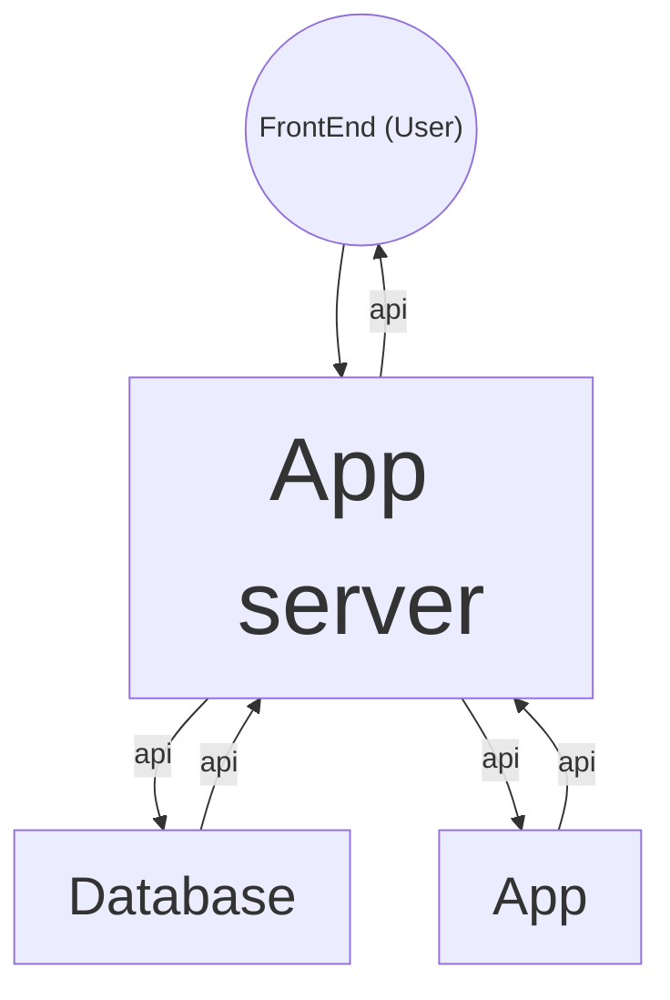

# Email Newsletter Architecture

## 1. Introduction

### 1.1 Purpose 

An email newsletter is system that is used to keep users update about the current changes and features of your company .

This project is about building an email news letter.
The the first part is to send blog post to user in a personalized manner to all clients. 
> Note:

- The server should be able to interact with the front end to get the users detail and store it in a database.
- The app is supposed to get the users details and send post to the user based on the user's interest.

### 1.2 Key Features Of The Email NewsLetter

The server should support the following

    - Multiple client connection
    - User authentication endpoint
    - Create post endpoint
    - Database for persistence

## 2. Architectural Overview

### 2.1 App Structure

#### a. Very High Level Diagram

This show how the user interacts with the system.

#### b. System Architecture

This diagram represent the interaction between the different components of the system

#### Components

- **App Server:** It is the server of the system and precise the endpoints for hosting the different services.
- **App:** It implement all the details of creating a blog post and sending it to the user via and email using the rust.
- **Database:** It is used to store user credentials and personal info.
- **Frontend:** The platform that allow the user to interact with the system.

### 2.2 Tools to use Use

- **Axum:** A powerful and robust frame work that allows to build efficiently allow for easy scalability.
- **Serde:** For serializing and deserializing data.
- **Docker and Docker compose:** to run test locally .
- **Postgres Database:** To manage client connections efficiently and create appropriate relationships.

### 2.3 End Point Specifications

|EndPoints|Services|
|---------|---------|
|`http://locahost:8080/app/`| Root of the application|
|`http://localhost:8080/app/login`| For login users.|
|`http://localhost:8080/app/login/users` | For logged in users. |
|`http://localhost:8080/app/blog `| The menu for blog posts.|
|`http://localhost:8080/app/blog/create` | To create a blog post.|
|`http://localhost:8080/app/blog/list` | To show all created blog posts|
