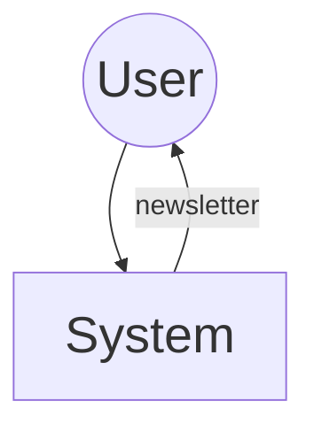
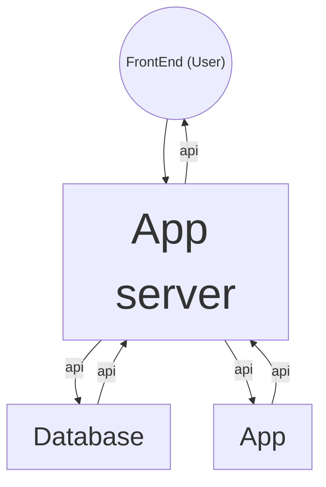

# Email Newsletter Architecture

## 1. Introduction
### 1.1 Purpose 
An email newsletter system is used to keep users updated about the current changes and features of your company.
This project is about building an email news letter.

### 1.2 Key Features

- Web Server
- Database (Postgres)
- Email Poster

## 2. Architectural Overview

#### a. Very High Level Diagram
This show how the user interacts with the system.

#### b. System Architecture
This diagram represent the interaction between the different components of the system

- ##### Components
    - **App Server:** It is the server of the system.
    - **App:** It implement all the details of the server using the rust.
    - **Database:** It is used to store user credentials and personal info.
    - **Frontend:** The platform that allow the user to interact with the system.

